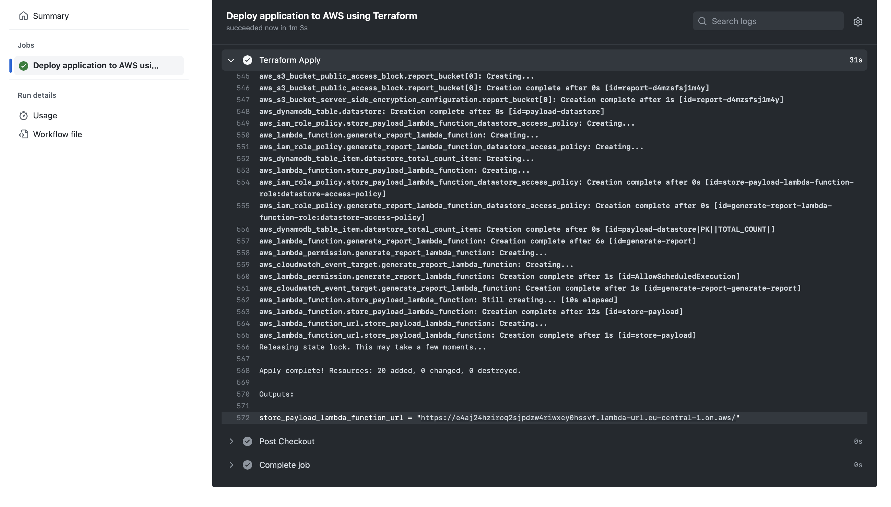
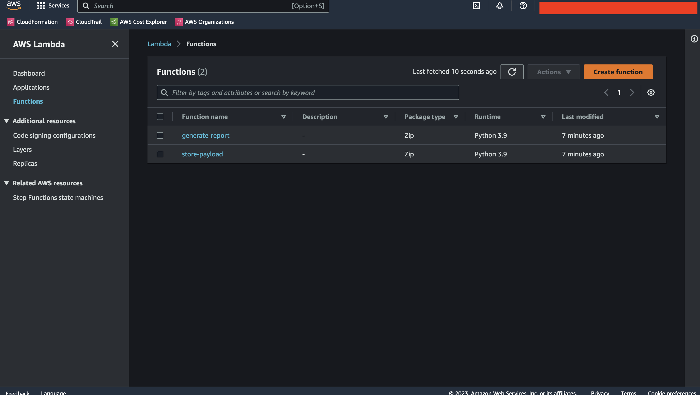

# Beagle Project

## Introduction


The solution consists of:
* Lambda Function that stores a request payload into the DynamoDB datastore
* Lambda Function that is triggered by an EventBridge rule each 7 days

The solution contains several GitHub Action workflows that automate deployment using Terraform. Workflows use remote S3 backend to store Terraform state files (for more details, see [Terraform S3 backend docs](https://developer.hashicorp.com/terraform/language/settings/backends/s3))

## How to deploy the solution to AWS?

1. Fork the repository or push source code to GitHub
2. In Project -> Secrets and Variables -> Actions -> Variables configure next environment variables:
    * `TF_BACKEND_STATE_BUCKET` - the name of a bucket where the Terraform state will be stored
    * `TF_BACKEND_STATE_KEY` - the name of an object where the Terraform state will be stored
    * `TF_BACKEND_LOCKS_DYNAMODB_TABLE` - the name of a DynamoDB table where Terraform locks will be stored
    * `REPORT_BUCKET_EXISTS` - the flag that shows if the report bucket already exists; if set to `false`, Terraform configuration will automatically create a new one
    * `REPORT_BUCKET_NAME` - the name of the bucket where reports will be stored
    * `AWS_REGION` - desired AWS region
    
3. In Project -> Secrets and Variables -> Actions -> Secrets configure next secrets:
    * `AWS_ACCESS_KEY_ID` - AWS Access Key that will be used for Terraform configuration deployment
    * `AWS_SECRET_ACCESS_KEY` - AWS Secret Access Key that will be used for Terraform configuration deployment
    
4. Run `Deploy Terraform backend to AWS` workflow which creates needed resources to store and maintain Terraform state and ensure it finished successfully

5. Run `Deploy application to AWS` workflow which creates application resources, and ensure it finished successfully

In the end of `Terraform Apply` step you can Function URL, like `https://<random-string>.lambda-url.<region>.on.aws/`. This URL can be used to store payload in the datastore

After running the deployment workflow, you can check that it has created two Lambda functions:


To see an initial report, open the configured S3 Report bucket in the AWS Console:


## How to use the solution?

To save a payload, send *POST* request to the Function URL (you can also find it in `store-payload` Lambda function resource in AWS console)
```
> curl -i \
  -d '{"key1":"value1", "key2":"value2"}' -H "Content-Type: application/json" \
  -X POST https://e4aj24hziroq2sjpdzw4riwxey0hssvf.lambda-url.eu-central-1.on.aws
```

**NOTE!** The function URL supports only POST requests on the root path. Any other requests will be rejected.


You can confirm that the payload was stored successfully using AWS DynamoDB console. Open it and retrieve all items from `payload-datastore` table:


In some period the `generate-report` Lambda function will be triggered automatically and generate a report with the total count of items in the datastore:


